<!-- ENDLESSLIU / DIGITAL PLAYGROUND -->

  

&nbsp;

&nbsp;

 

---

# ◈ THE PERSON BEHIND THE SCREEN

<table>
<tr>
<td width="58%" valign="top">

### Hi, I'm <strong>EndlessLiu</strong>.

A computer science student building a personal corner of the internet while learning how the systems behind it actually work.

I enjoy the overlap between <strong>code, design, AI and real life</strong>.

<pre>
CURRENTLY
────────────────────────────────────────────
01  studying CS / 408
02  exploring AI agents
03  engineering my personal blog
04  learning by building in public
05  keeping myself moving
────────────────────────────────────────────
</pre>

I don't want every project to look like a tutorial demo.

I want it to feel like <strong>mine</strong>.

</td>
<td width="42%" valign="top" align="center">

  

<code>ENDLESS MODE // ON</code>

  

<strong>CURIOUS</strong> 
always asking why

  

<strong>BUILDING</strong> 
always making something

  

<strong>MOVING</strong> 
code, life, running

</td>
</tr>
</table>

---

# ◈ MY CURRENT UNIVERSE

<table>
<tr>
<td width="25%" align="center">

### 🎓
01 / FOUNDATION
 <strong>CS · 408</strong>
 notes, algorithms, systems

</td>
<td width="25%" align="center">

### 🤖
02 / FRONTIER
 <strong>AI · AGENTS</strong>
 agents, tools, workflows

</td>
<td width="25%" align="center">

### 🌐
03 / PLAYGROUND
 <strong>WEB · UI</strong>
 interfaces, animation, interaction

</td>
<td width="25%" align="center">

### 🏃
04 / OFFLINE
 <strong>RUNNING</strong>
 distance, discipline, reset

</td>
</tr>
</table>

> <strong>The goal isn't to look busy. The goal is to keep becoming capable.</strong>

---

# ◈ FEATURED: MY DIGITAL HOME

<table>
<tr>
<td width="62%" valign="top">

## ENDLESSLIU.GITHUB.IO

My personal website is the place where everything gets more visual.

<strong>Tech:</strong> Hexo · GitHub Pages · JavaScript · CSS

<strong>Theme direction:</strong> dark glass · anime atmosphere · neon HUD · motion UI

<strong>Inside:</strong> articles · photo wall · music · experiments · life notes · personal pages

 

</td>
<td width="38%" valign="top">

### DESIGN PRINCIPLE

<pre>
information
      ↓
structure
      ↓
interaction
      ↓
emotion
      ↓
identity
</pre>

A website should not only answer:

<strong>"What does this person know?"</strong>

It should also answer:

<strong>"What does this person feel like?"</strong>

</td>
</tr>
</table>

---

# ◈ WHAT'S IN THE LAB

<table>
<tr>
<td width="50%" valign="top">

### 01 — AI AGENT LAB

Exploring how AI agents can turn natural-language goals into useful actions, workflows and tools.

<strong>Currently:</strong> experimenting · learning · prototyping

</td>
<td width="50%" valign="top">

### 02 — PERSONAL UI LAB

Trying strange little ideas until the interface stops feeling like a template.

<strong>Currently:</strong> motion · glass · HUD · micro-interactions

</td>
</tr>

<tr>
<td width="50%" valign="top">

### 03 — KNOWLEDGE BASE

Turning 408 study notes, debugging scars and things I finally understand into reusable documentation.

<strong>Currently:</strong> networking · CS fundamentals · coding notes

</td>
<td width="50%" valign="top">

### 04 — LIFE LOG

Running, learning, building, getting stuck, trying again.

The offline part of the profile matters too.

</td>
</tr>
</table>

---

# ◈ TOOLBOX

<code>C++</code>
<code>Python</code>
<code>JavaScript</code>
<code>HTML</code>
<code>CSS</code>
<code>Node.js</code>
<code>Git</code>
<code>Linux</code>
<code>Hexo</code>

---

# ◈ GITHUB TELEMETRY

<table>
<tr>
<td width="50%" valign="top">

</td>
<td width="50%" valign="top">

</td>
</tr>
</table>

Contributions are the footprint. Projects are the story.

---

# ◈ THE AESTHETIC SYSTEM

<table>
<tr>
<td align="center" width="20%"><strong>DARK</strong> deep space</td>
<td align="center" width="20%"><strong>NEON</strong> cyan → blue → violet</td>
<td align="center" width="20%"><strong>GLASS</strong> soft surfaces</td>
<td align="center" width="20%"><strong>MOTION</strong> scan · orbit · pulse</td>
<td align="center" width="20%"><strong>CHARACTER</strong> not another template</td>
</tr>
</table>

---

# ◈ A FEW THINGS I BELIEVE

<pre>
Build ugly first.
Then make it useful.
Then make it beautiful.

Read the documentation.
Still experiment.

Don't wait until you feel ready.
Make a smaller thing.
Ship it.
Learn from it.

Progress is not always loud.
Sometimes it is just:
"Today I finally understood this."
</pre>

---

# ◈ ROADMAP // UNLOCKED

<table>
<tr>
<td width="33%" valign="top">

### 01
<strong>MASTER THE CORE</strong>

Build a stronger CS foundation and stop being afraid of hard concepts.

</td>
<td width="33%" valign="top">

### 02
<strong>GO DEEPER INTO AI</strong>

Move from using AI tools to understanding and building agent workflows.

</td>
<td width="33%" valign="top">

### 03
<strong>SHIP MORE</strong>

Less collecting ideas.

More small, finished, public things.

</td>
</tr>
</table>

---

## <code>ENDLESSLIU.EXE</code>

<pre>
┌───────────────────────────────────────┐
│ STATUS    : ONLINE                    │
│ MODE      : BUILDING                  │
│ ENERGY    : RECHARGING                │
│ NEXT      : SHIP SOMETHING            │
└───────────────────────────────────────┘
</pre>

<strong>KEEP LEARNING · KEEP BUILDING · KEEP MOVING</strong>

  

  

EndlessLiu · personal digital playground · built in public

