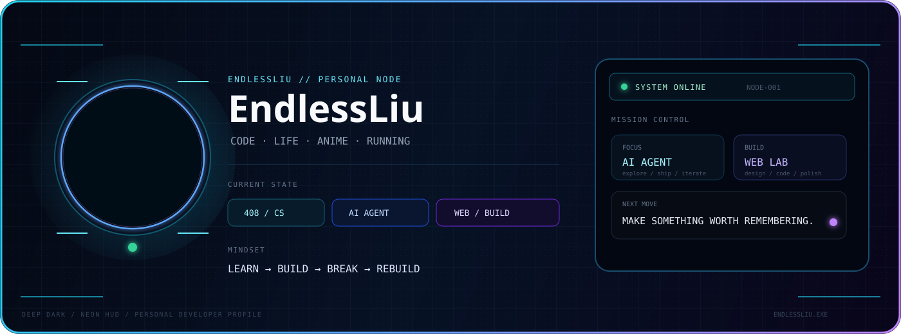

<!-- EndlessLiu · GitHub Profile -->

 

  

---

## <code>01 / IDENTITY</code>

<table>
<tr>
<td width="50%" valign="top">

### Hey, I'm EndlessLiu 👋

I'm a computer science student who enjoys turning curiosity into something visible.

My current path is a mix of:

<pre>CS FUNDAMENTALS
AI AGENTS
WEB DEVELOPMENT
PERSONAL BUILDING</pre>

I like projects that have both a <strong>working core</strong> and a <strong>distinct personality</strong>.

</td>
<td width="50%" valign="top">

### Current Orbit

| Area | Status |
|:--|:--|
| 🎓 CS / 408 | STUDYING |
| 🤖 AI / Agent | EXPLORING |
| 🌐 Web / UI | BUILDING |
| 📝 Blog | SHIPPING |
| 🏃 Running | MOVING |

 

> <strong>Learn something. Build something. Leave a trace.</strong>

</td>
</tr>
</table>

---

## <code>02 / SELECTED WORK</code>

<table>
<tr>
<td width="33%" valign="top">

### 🌌 Personal Blog

<strong>EndlessLiu · Code & Life</strong>

A Hexo + GitHub Pages site where code, notes, anime, experiments and everyday life live together.

</td>

<td width="33%" valign="top">

### ⚡ Blog Lab

<strong>EndlessLiu.github.io</strong>

Theme engineering, animated UI, visual experiments, articles and the little details that make a personal site feel alive.

</td>

<td width="33%" valign="top">

### 🧪 Next Experiments

<strong>AI Agent Playground</strong>

Exploring agent workflows, developer tools and practical automation — one experiment at a time.

<pre>IDEA
 ↓
PROTOTYPE
 ↓
BREAK IT
 ↓
SHIP IT</pre>

</td>
</tr>
</table>

---

## <code>03 / TOOLBOX</code>

  

  

<code>CODE</code> · <code>WEB</code> · <code>AI</code> · <code>GIT</code> · <code>HEXO</code> · <code>LINUX</code>

---

## <code>04 / TELEMETRY</code>

<table>
<tr>
<td width="50%">

</td>
<td width="50%">

</td>
</tr>
</table>

---

## <code>05 / CONTRIBUTION LAB</code>

  

  Every green square is a tiny reminder that something was built, learned, fixed or understood.

---

## <code>06 / PERSONAL ARCHIVE</code>

<table>
<tr>
<td align="center" width="25%">

### 🖥️

BUILD

<strong>WEB & UI</strong>

</td>
<td align="center" width="25%">

### 🤖

EXPLORE

<strong>AI AGENTS</strong>

</td>
<td align="center" width="25%">

### 📚

DEEPEN

<strong>CS / 408</strong>

</td>
<td align="center" width="25%">

### 🏃

MOVE

<strong>RUNNING</strong>

</td>
</tr>
</table>

---

## <code>07 / OPERATING PRINCIPLES</code>

<pre>01  Make it work.
02  Make it clear.
03  Make it beautiful.
04  Break it.
05  Rebuild it better.
06  Keep moving.</pre>

### <code>ENDLESSLIU.EXE</code>

<strong>STATUS</strong>  <code>ONLINE</code> 
<strong>MODE</strong>    <code>LEARNING</code> 
<strong>MISSION</strong> <code>KEEP BUILDING</code>

  

Code · Life · Anime · Running

  

