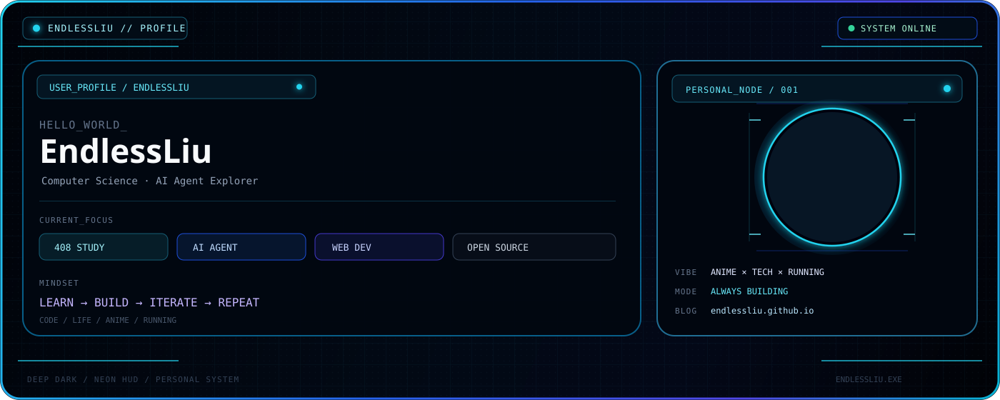

 

  

---

<table>
<tr>
<td width="58%" valign="top">

## <code>01 // SYSTEM PROFILE</code>

<pre>
┌──────────────────────────────────────────────┐
│ EndlessLiu@github                            │
├──────────────────────────────────────────────┤
│                                              │
│ $ whoami                                     │
│ > Computer Science Student                   │
│                                              │
│ $ current_focus                              │
│ > AI Agent                                   │
│ > Web Development                            │
│ > 408 Postgraduate Exam                      │
│                                              │
│ $ mindset                                    │
│ > LEARN → BUILD → ITERATE                    │
│                                              │
│ $ status                                     │
│ > [ ONLINE ]                                 │
│                                              │
└──────────────────────────────────────────────┘
</pre>

</td>

<td width="42%" align="center" valign="middle">

  

### <code>ENDLESS MODE</code>

<code>CODE</code> → <code>LEARN</code> → <code>BUILD</code> → <code>RUN</code>

  

<em>Building things I like. Learning things I need. Exploring things I love.</em>

</td>
</tr>
</table>

---

## <code>02 // GITHUB ANALYTICS</code>

<table>
<tr>
<td width="50%" valign="top">

</td>

<td width="50%" valign="top">

</td>
</tr>
</table>

---

## <code>03 // TROPHY & SKILLS</code>

---

## <code>04 // CONTRIBUTION MATRIX</code>

CONTRIBUTION ACTIVITY · GENERATED AUTOMATICALLY

---

## <code>05 // CURRENT MISSIONS</code>

<table>
<tr>
<td width="33%" align="center">

### <code>CS / 408</code>

Computer Science fundamentals

  

<code>STUDYING</code>

</td>

<td width="33%" align="center">

### <code>AI / AGENT</code>

Exploring AI agents and new tools

  

<code>EXPLORING</code>

</td>

<td width="33%" align="center">

### <code>WEB / BUILD</code>

Improving my personal blog

  

<code>BUILDING</code>

</td>
</tr>
</table>

---

## <code>06 // FEATURED PROJECTS</code>

<table>
<tr>
<td width="50%" valign="top">

### 🌐 EndlessLiu Blog

A personal space built with Hexo + GitHub Pages.

<code>Code · Life · Anime · Running</code>

  

</td>

<td width="50%" valign="top">

### ⚡ Blog Source

The source code behind the blog, including theme customization, components and experiments.

  

</td>
</tr>
</table>

---

## <code>07 // ANIME ARCHIVE</code>

&nbsp;&nbsp;

---

## <code>08 // DAILY LOOP</code>

<table>
<tr>
<td align="center">💻 <strong>LEARN</strong> Something new</td>
<td align="center">🛠️ <strong>BUILD</strong> Something useful</td>
<td align="center">🏃 <strong>RUN</strong> A little farther</td>
<td align="center">🌌 <strong>EXPLORE</strong> Something unknown</td>
</tr>
</table>

---

## <code>ENDLESSLIU.EXE</code>

<pre>
STATUS  : ONLINE
MODE    : LEARNING
MISSION : KEEP BUILDING
</pre>

<strong>✨ Keep Building · Keep Learning · Keep Moving</strong>

  

Code · Life · Anime · Running

