<!-- ENDLESSLIU / SIGNATURE PROFILE v4 -->

  

&nbsp;

&nbsp;

  
01:07 / PERSONAL DIGITAL SPACE / ENDLESSLIU

---

<table>
<tr>
<td width="63%" valign="top">

# I'M ENDLESSLiu.

### I build. I break. I rebuild.

I'm a computer science student exploring the space between **software, interfaces, AI and everyday life**.

I enjoy making things that are useful enough to keep and weird enough to remember.

<pre>
NOW
──────────────────────────────────────────────
FOCUS      CS / 408
EXPLORING  AI AGENTS
BUILDING   WEB + UI
KEEPING    RUNNING
DOCUMENT   WHAT I LEARN
──────────────────────────────────────────────
</pre>

</td>
<td width="37%" align="center" valign="top">

  

<code>NOT A TEMPLATE</code>

  

code
 
design
 
anime
 
running

  

<code>ALWAYS IN PROGRESS</code>

</td>
</tr>
</table>

---

## THE BIG IDEA

### A GitHub profile shouldn't feel like a CV.

It should feel like opening someone's little corner of the internet.

 

<table>
<tr>
<td align="center" width="25%">

### 01

<strong>LEARN</strong>

Understand the fundamentals instead of only memorizing the surface.

</td>
<td align="center" width="25%">

### 02

<strong>MAKE</strong>

Turn an idea into something a real person can touch.

</td>
<td align="center" width="25%">

### 03

<strong>POLISH</strong>

Details matter when the project becomes your signature.

</td>
<td align="center" width="25%">

### 04

<strong>MOVE</strong>

Keep the body and the mind going together.

</td>
</tr>
</table>

---

# THE LAB

<table>
<tr>
<td width="50%" valign="top">

## 🤖 AGENT LAB

I'm moving beyond simply chatting with AI tools and learning how agents can **reason, use tools, automate workflows and actually get things done**.

<pre>
goal
 ↓
plan
 ↓
tools
 ↓
action
 ↓
result
</pre>

</td>
<td width="50%" valign="top">

## 🌐 UI LAB

The place where I try to make interfaces feel less like software and more like a **place you want to stay in**.

Current ingredients:

<code>glass</code>
<code>motion</code>
<code>HUD</code>
<code>dark mode</code>
<code>anime</code>

</td>
</tr>
<tr>
<td width="50%" valign="top">

## 📚 KNOWLEDGE LAB

408 preparation, networking, programming fundamentals and all the concepts that took a few extra tries to finally click.

The rule:

<strong>Understand it → write it down → make it reusable.</strong>

</td>
<td width="50%" valign="top">

## 🏃 OFFLINE MODE

Running is the part of the system that doesn't happen behind a screen.

Distance teaches rhythm.

Consistency teaches patience.

</td>
</tr>
</table>

---

# ONE PROJECT I CARE ABOUT

## 🌌 ENDLESSLIU · CODE & LIFE

<strong>My personal website → <a href="https://endlessliu.github.io/">endlessliu.github.io</a></strong>

<table>
<tr>
<td width="45%" valign="top">

### WHAT IT IS

A personal website built with **Hexo + GitHub Pages**.

It is part blog, part notebook, part visual playground, part life log.

</td>
<td width="55%" valign="top">

### WHAT I'M TRYING TO MAKE IT

<pre>
blog
 +
photo wall
 +
music
 +
anime atmosphere
 +
interactive UI
 +
personal story
        ↓
a place that feels like me
</pre>

</td>
</tr>
</table>

&nbsp;

---

# MY STACK

<code>C++</code> · <code>Python</code> · <code>JavaScript</code> · <code>HTML</code> · <code>CSS</code> · <code>Node.js</code> · <code>Git</code> · <code>Linux</code>

---

# LIVE TELEMETRY

<table>
<tr>
<td width="50%" valign="top">

</td>
<td width="50%" valign="top">

</td>
</tr>
</table>

---

# THE AESTHETIC

<table>
<tr>
<td width="20%" align="center">

### BLACK

space

</td>
<td width="20%" align="center">

### CYAN

energy

</td>
<td width="20%" align="center">

### VIOLET

dream

</td>
<td width="20%" align="center">

### GLASS

depth

</td>
<td width="20%" align="center">

### MOTION

life

</td>
</tr>
</table>

dark interface · anime atmosphere · developer HUD · soft neon · controlled chaos

---

# SMALL THINGS I'M BUILDING TOWARD

<pre>
[01]  stronger computer science fundamentals
[02]  deeper AI agent understanding
[03]  better front-end craftsmanship
[04]  more finished public projects
[05]  a personal website worth revisiting
[06]  a life that isn't only about the screen
</pre>

---

# CURRENT MOOD

### "Make it work."

### "Then make it yours."

 

There are enough copies on the internet.
 
I'm trying to leave one original thing behind.

---

<pre>
╭──────────────────────────────────────────────╮
│                                              │
│              ENDLESSLIU.EXE                 │
│                                              │
│   STATUS   ONLINE                            │
│   MODE     BUILDING                          │
│   FOCUS    NEXT THING                        │
│   SIGNAL   STRONG                            │
│                                              │
╰──────────────────────────────────────────────╯
</pre>

<strong>KEEP LEARNING · KEEP BUILDING · KEEP MOVING</strong>

  

  

EndlessLiu · personal digital playground · 2026

